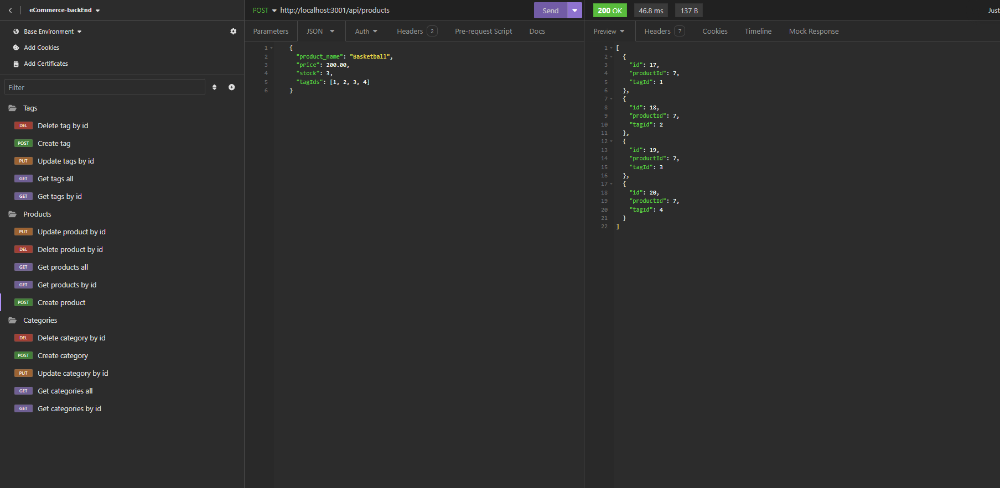

# E-Commerce Back End

## The Project

This project was designed for the manager/s of an e-commerce website to be able to track stock items, levels, prices and categories. They are then able to manipulate data by viewing, adding, updating or deleting values. Other features include:

- The ability to view different sets of data by type.
- Automatically changing related values such as product tags.
- Seed commands to allow insertion of bulk data.

## Link & Contents

- [Video Walkthrough](https://www.loom.com/share/c0286ddeb408458cabdb0693e59ae576?sid=b1bcf343-ab37-4707-97f5-9371c5f34165)
- [Installation](#installation)
- [Usage](#usage)
- [Future Development](#future-development)
- [Credits](#credits)
- [Questions and Feedback](#questions-and-feedback)
- [License](#license)

## Image

## Installation

- Clone the repository to your local machine.
- Update the .env.EXAMPLE file with your postgres login and remove .EXAMPLE from the file name.
- Open gitbash or similar in the root folder.
- Run "npm install".
- Login to postgres by entering "psql -U postgres".
- Enter "\i ./db/schema.sql" to create database.
- Enter "\q".
- Enter "npm run seed" to add base data to database.

## Usage

[Video Walkthrough](https://www.loom.com/share/c0286ddeb408458cabdb0693e59ae576?sid=b1bcf343-ab37-4707-97f5-9371c5f34165)

After completing all installation instructions navigate to the root folder in gitbash or similar and enter "npm start".

Use Insomnia, Postman or something similar to test different request types.

Available endpoints are:

Get and Post can use:

- /api/categories
- /api/products
- /api/tags

Get, Put and Delete can use:

- /api/categories/:id
- /api/products/:id
- /api/tags/:id

## Future Development

Ideas for future development include:

- Adding extra columns.
- Including additional tables.
- Adding a gui component.

## Credits

Starter code provided by edX/Monash University.

Project requirements provided by edX/Monash University.

Project set by edX/Monash University. Made use of the Xpert learning assistant, AskBcs and our instructor with troubleshooting issues.

GitHub for hosting the repository.

Screencastify for the walkthrough video.

## Questions and Feedback

If you find any issues or have contributions or feedback you can do so by opening an [issue](https://github.com/Jiske-N/eCommere-backEnd/issues) on Github.

## License

None
